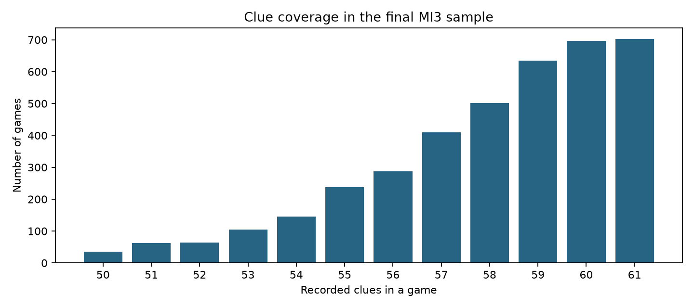
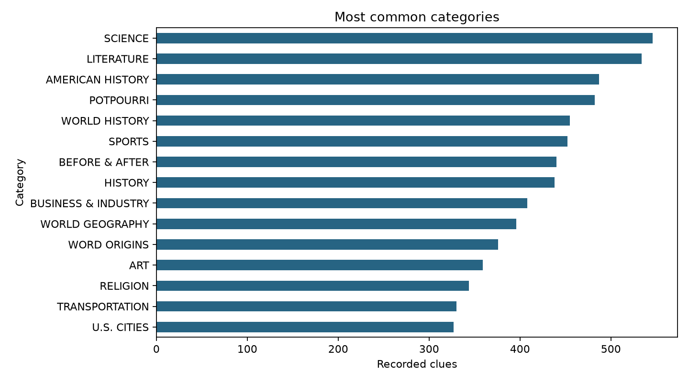

# Exploratory Analysis Outputs

This folder contains the tables and figures created during the final exploratory analysis. The outputs summarize the final game sample, clue coverage, missing text, common clue categories, common words, contestant position, and optional SOC/CIP mapping uncertainty.

## Exploratory Plots

### Clue Records per Game



**Figure 1. Distribution of unique clue records per game.** Most games contain close to a complete board, but a small number have limited clue coverage. Games with fewer than 50 recorded clues were removed from the final analysis.

### Most Frequent Categories



**Figure 2. Twenty most frequent category labels in the dataset.** Repeated subjects provide useful text for comparing game boards with contestant occupations. Differences and wordplay in category names support comparing meaning rather than requiring exact word matches.

## Output Files

| File | Description |
|---|---|
| `games_by_clue_count.png` | Plot showing the distribution of unique clue records per game. |
| `top_categories.png` | Plot showing the twenty most frequent category labels. |
| `sample_overview.csv` | Counts describing the final analysis sample. |
| `games_by_clue_count.csv` | Number of games for each recorded clue count. |
| `round_summary.csv` | Summary of clues by Jeopardy round. |
| `missing_text.csv` | Counts of missing contestant and clue text fields. |
| `top_categories.csv` | Counts for the most frequent category labels. |
| `clue_words.csv` | Common words found in clue text. |
| `occupation_words.csv` | Common words found in contestant occupation text. |
| `winner_rate_by_position.csv` | Recorded winner rate by contestant position. |
| `soc_uncertainty_summary.csv` | Summary of occupation-to-SOC mapping uncertainty. |
| `cip_mapping_summary.csv` | Summary of optional SOC-to-CIP mappings. |

## Reproducing These Outputs

These files are produced by:

```text
Scripts/Final_EDA.ipynb
```

The notebook uses:

```text
Data/final_contestant_games.csv
Data/jeopardy_raw_contestant_clue_data.csv.gz
```

Run every cell in the notebook from top to bottom. The resulting figures and summary tables should be saved in `Output/eda_final_outputs/`.
