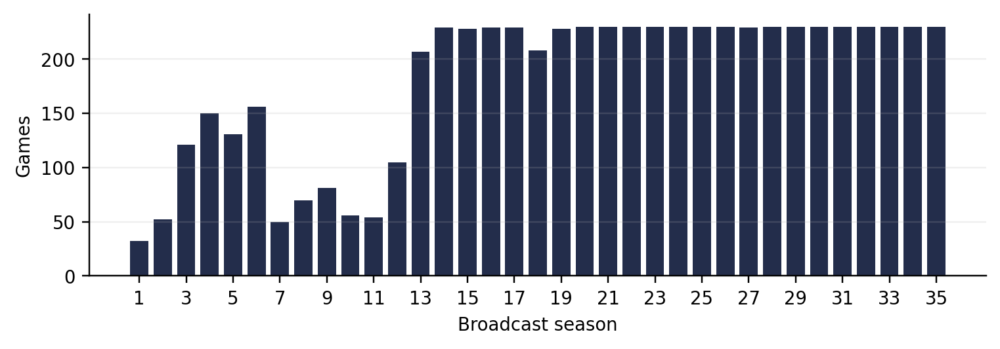
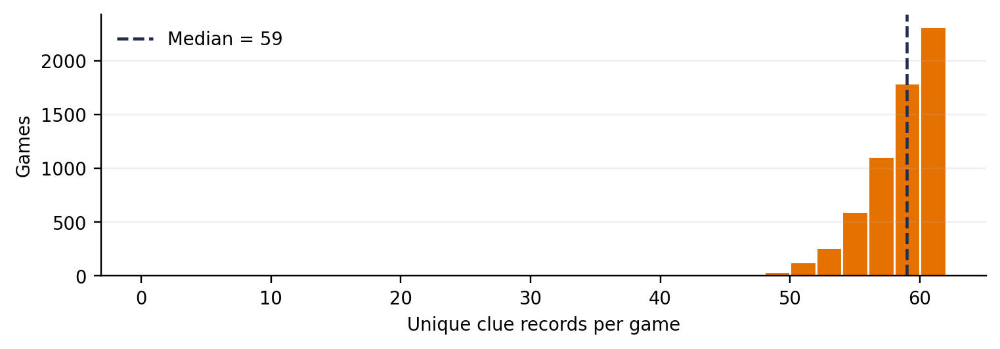

# Initial EDA Outputs

This folder contains every figure and CSV summary produced by `Scripts/Initial_EDA.ipynb`. The notebook explores the original connected contestant-clue dataset before the final filtering and modeling steps.

## Plots Used in MI2

The following files are copies of the two exploratory plots included in the MI2 data-establishment report:

- `MI2_games_by_season.png`: number of archived games available by season.
- `MI2_clue_coverage_distribution.png`: distribution of unique clue records per game.

These correspond to the current notebook outputs `01_games_by_season.png` and `03_clues_per_game.png`. The `MI2_` files preserve the exact versions used in the report.

### MI2 Figure 1: Games by Season

The number of available games varies across seasons, showing that archive coverage is not uniform over time.

### MI2 Figure 2: Clue Coverage per Game

Most games contain close to a complete board, but a small number have limited clue coverage. This finding supported excluding games with fewer than 50 recorded clues from the final analysis.

## Complete Plot List

| File | Description |
|---|---|
| `01_games_by_season.png` | Number of archived games by season. |
| `02_games_by_year.png` | Number of archived games by air year. |
| `03_clues_per_game.png` | Distribution of unique clue records per game. |
| `04_completeness_thresholds.png` | Percentage of games retained under possible clue-count thresholds. |
| `05_win_rate_by_position.png` | Recorded win rate by contestant position. |
| `06_final_score_by_winner.png` | Descriptive final-score distribution by winner status. Final score is not used as a predictor. |
| `07_introduction_word_counts.png` | Distribution of contestant-introduction length. |
| `08_top_categories.png` | Twenty most frequent Jeopardy! category labels. |
| `09_clues_by_round.png` | Number of unique clue records by round. |
| `10_clue_values_by_round.png` | Distribution of clue values in the Jeopardy and Double Jeopardy rounds. |
| `11_common_introduction_words.png` | Most frequent words in contestant introductions. |
| `12_contestant_appearances.png` | Number of archived appearances per contestant. |

## Summary Tables

| File | Description |
|---|---|
| `eda_game_summary.csv` | One row per game with game information and its recorded clue count. |
| `eda_position_summary.csv` | Contestant counts, winner counts, and win rates by contestant position. |
| `eda_completeness_thresholds.csv` | Percentage of games retained at each possible minimum-clue threshold. |

## Reproduction

The outputs are generated from:

- Notebook: `Scripts/Initial_EDA.ipynb`
- Input: `Data/jeopardy_raw_contestant_clue_data.csv.gz`

The later `Output/eda_final_outputs/` folder describes the filtered 3,882-game dataset used for the final models.
